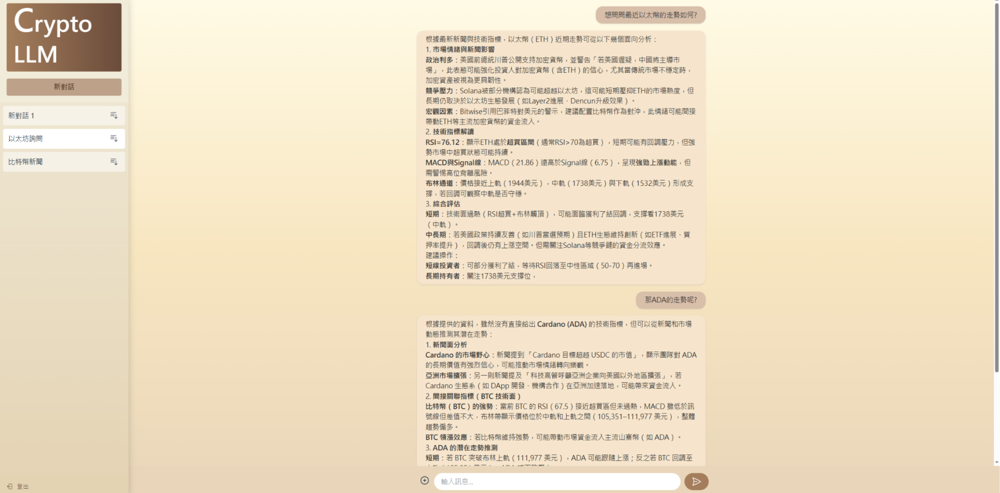

# 💹 CryptoLLM：加密貨幣智能助手

一個結合語意搜尋、技術分析與語言生成的 AI 系統，協助使用者**即時理解市場動向**，掌握加密貨幣投資關鍵。
---

## 📌 專案簡介

**CryptoLLM** 的目標是打造一個智能對話系統，能夠整合新聞資訊、技術指標與大型語言模型，回答使用者關於加密貨幣市場的問題。

### 🔧 核心功能

- **語意檢索**  
  使用自然語言提問，從新聞資料中找出最相關內容。

- **技術分析**  
  自動分析 RSI、MACD、布林通道等技術指標，並產生趨勢解讀。

- **AI 回應引擎**  
  整合 LLM，產出具邏輯性與可信度的回答，並標示資料來源。
---

## 💡 使用情境
- 「比特幣這週走勢如何？」
- 「最近以太坊有什麼新聞？」
- 「幫我分析 SOL 的技術指標。」
---

## 🖥️ 技術整合
| 功能模組     | 使用技術 |
|--------------|-----------|
| 語意搜尋     | ChromaDB + SentenceTransformer |
| 技術指標     | pandas 計算 RSI、MACD、布林通道 |
| 語言生成     | DeepSeek-v3 API |
| 資料儲存     | PostgreSQL（新聞、幣價、指標資料） |
| 前端展示     | Vue.js + Tailwind CSS |
| 後端框架     | Python Flask |

---

## 📷 系統畫面一覽
> 🧾 聊天介面可即時查詢特定幣種新聞與技術指標  
> 📉 指標數據由 pandas 計算並自動生成解讀文字  

>
> ## 後端 repositories
https://github.com/m122979809/crypto-LLM
